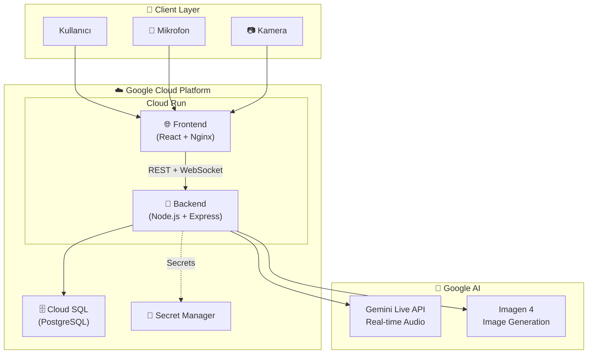

# Nöra - Bilişsel Tarama AI Asistanı

> **Gemini Hackathon 2026 - Live Agents Kategorisi**
>
> Alzheimer ve bilişsel bozulma riski için gerçek zamanlı sesli-görsel etkileşimli ön tarama AI ajanı.

---

## 📋 Yarışma Teslim Linkleri

| Teslim | URL |
|---|---|
| **Public Repository** | https://github.com/knowhycodata/knowhy_gemini_live_agent_challange |
| **Live Demo** | https://nora-frontend-806414321712.us-central1.run.app |
| **Backend API** | https://nora-backend-806414321712.us-central1.run.app |
| **Demo Video (<4 dk)** | *Kayıt sonrası eklenecek* |
| **GCP Proof Video** | *Kayıt sonrası eklenecek* |

---

## ✅ Yarışma Şartları Kanıtı

### Zorunlu Gereksinimler

| # | Gereksinim | Durum | Kanıt Dosyası |
|---|---|---|---|
| 1 | Gemini modeli kullanımı | ✅ | [`packages/backend/package.json`](packages/backend/package.json) - `@google/genai` |
| 2 | GenAI SDK veya ADK | ✅ | [`packages/backend/src/services/geminiLive.js`](packages/backend/src/services/geminiLive.js) |
| 3 | Live Agents (real-time audio/vision) | ✅ | [`packages/frontend/src/hooks/useGeminiLive.js`](packages/frontend/src/hooks/useGeminiLive.js) |
| 4 | Multimodal giriş/çıkış | ✅ | Ses, metin, görsel üretim, kamera analizi |
| 5 | En az bir GCP servisi | ✅ | Cloud Run, Cloud SQL, Secret Manager |
| 6 | README spin-up instructions | ✅ | Aşağıda "Hızlı Başlangıç" bölümü |
| 7 | Architecture Diagram | ✅ | Aşağıda "Architecture" bölümü |
| 8 | Public Code Repository | ✅ | [GitHub Link](https://github.com/knowhycodata/knowhy_gemini_live_agent_challange) |

### Bonus Gereksinimler

| # | Bonus | Durum | Kanıt |
|---|---|---|---|
| 1 | IaC / Automated Deployment | ✅ | [`deploy-gcp.sh`](deploy-gcp.sh) + [`cloudbuild.yaml`](cloudbuild.yaml) |
| 2 | Blog/Podcast/Video | ✅ | https://knowhyco.substack.com/p/when-we-forget-what-we-have-forgotten |
| 3 | GDG Üyeliği | ❌ | - |

---

## 🎯 Proje Özeti

Nöra, kullanıcı ile doğal konuşma akışında ilerleyen bir bilişsel tarama deneyimi sunar:

- **Gemini Live API** ile gerçek zamanlı sesli konuşma (kesintiye dayanıklı)
- **Imagen 4** ile görsel üretim ve tanıma testleri
- **Kamera analizi** ile odak, mimik, göz teması gözlemleri
- **Deterministik skorlama** - LLM hesaplamaz, backend algoritmaları hesaplar

### Özellikler

| Özellik | Açıklama |
|---|---|
| 🎤 Canlı Sesli Konuşma | AudioWorklet + WebSocket ile düşük gecikmeli akış |
| 🖼️ Görsel Test | Imagen 4 ile görsel üretim, tanıma testi |
| 📷 Kamera Analizi | Gerçek zamanlı davranış/odak analizi |
| 📊 Sonuç Ekranı | Test bazlı skorlar, risk durumu, PDF rapor |
| 🔐 Güvenlik | JWT auth, rate-limit, input validation |

---

## 🏗️ Architecture Diagram



---

## 📁 Proje Yapısı

```text
gemini_challenge/
├── packages/
│   ├── frontend/          # React + Vite + TailwindCSS
│   └── backend/           # Node.js + Express + Prisma
├── deploy-gcp.sh          # ⭐ IaC: Otomatik GCP deploy scripti
├── cloudbuild.yaml        # ⭐ IaC: Cloud Build CI/CD pipeline
├── docker-compose.yml     # Lokal geliştirme
├── .env.example           # Environment variables şablonu
└── README.md
```

---

## 🚀 Hızlı Başlangıç (Lokal)

### Ön Gereksinimler

| Gereksinim | Versiyon |
|---|---|
| Node.js | 20+ |
| Docker & Docker Compose | Latest |
| Google Gemini API Key | - |

### Kurulum

```bash
# 1. Repo'yu klonla
git clone https://github.com/knowhycodata/knowhy_gemini_live_agent_challange.git
cd knowhy_gemini_live_agent_challange

# 2. Environment variables ayarla
cp .env.example .env
# .env içine GOOGLE_API_KEY ve JWT_SECRET girin

# 3. Bağımlılıkları kur ve veritabanını hazırla
npm install
npm run db:migrate
npm run db:seed

# 4. Uygulamayı başlat
npm run dev
```

### Alternatif: Docker Compose

```bash
docker-compose up -d
```

### Lokal URL'ler

| Servis | URL |
|---|---|
| Frontend | http://localhost:5173 |
| Backend | http://localhost:3001 |
| Health Check | http://localhost:3001/api/health |

### Demo Hesap

| Alan | Değer |
|---|---|
| E-posta | `demo@nora.ai` |
| Şifre | `demo123` |

---

## ☁️ Google Cloud Deploy

> **Yarışma Şartı:** Backend Google Cloud üzerinde çalışmalıdır.
>
> **Kanıt:** [Live Demo](https://nora-frontend-806414321712.us-central1.run.app) + [Backend Health](https://nora-backend-806414321712.us-central1.run.app/api/health)

### Yöntem 1: Otomatik Deploy Script (⭐ Bonus: IaC)

**Dosya:** [`deploy-gcp.sh`](deploy-gcp.sh)

Tek komutla tüm GCP altyapısını kurar:

```bash
# 1. Ön gereksinimler
gcloud auth login

# 2. Env vars ayarla
export GCP_PROJECT_ID="YOUR_PROJECT_ID"
export GCP_REGION="us-central1"
export GOOGLE_API_KEY="YOUR_GOOGLE_API_KEY"
export JWT_SECRET="YOUR_JWT_SECRET"
export DB_PASSWORD="STRONG_DB_PASSWORD"

# 3. Deploy scriptini çalıştır
bash deploy-gcp.sh
```

Script şunları otomatik yapar:
- GCP API'lerini etkinleştirir
- Artifact Registry oluşturur
- Cloud SQL (PostgreSQL 16) kurar
- Secret Manager'a anahtarları yazar
- Backend ve Frontend Docker image'lerini build eder
- Her iki servisi Cloud Run'a deploy eder
- CORS ayarlarını günceller
- Health check yapar

### Yöntem 2: Cloud Build CI/CD (⭐ Bonus: IaC)

**Dosya:** [`cloudbuild.yaml`](cloudbuild.yaml)

GitHub'dan otomatik trigger ile CI/CD pipeline:

```bash
# Manuel tetikleme
gcloud builds submit --config=cloudbuild.yaml .

# Veya trigger oluşturma (GitHub repo bağlandıktan sonra)
gcloud builds triggers create github \
  --repo-name=YOUR_REPO \
  --repo-owner=YOUR_GITHUB_USER \
  --branch-pattern="^main$" \
  --build-config=cloudbuild.yaml
```

### Yöntem C: Manuel Adım Adım Deploy

<details>
<summary>Manuel adımları görmek için tıklayın</summary>

#### 6.1 GCP Hazırlık

```bash
export PROJECT_ID="YOUR_PROJECT_ID"
export REGION="us-central1"
export REPO_NAME="nora-repo"

gcloud auth login
gcloud config set project $PROJECT_ID

gcloud services enable \
  run.googleapis.com \
  cloudbuild.googleapis.com \
  artifactregistry.googleapis.com \
  secretmanager.googleapis.com \
  sqladmin.googleapis.com
```

#### 6.2 Artifact Registry + Image Build

```bash
gcloud artifacts repositories create $REPO_NAME \
  --repository-format=docker \
  --location=$REGION

# Backend
gcloud builds submit ./packages/backend \
  --tag $REGION-docker.pkg.dev/$PROJECT_ID/$REPO_NAME/nora-backend:latest

# Frontend
gcloud builds submit ./packages/frontend \
  --tag $REGION-docker.pkg.dev/$PROJECT_ID/$REPO_NAME/nora-frontend:latest
```

#### 6.3 Cloud SQL (PostgreSQL) Oluşturma

```bash
gcloud sql instances create nora-pg \
  --database-version=POSTGRES_16 \
  --tier=db-custom-1-3840 \
  --region=$REGION

gcloud sql databases create cognitive_agent --instance=nora-pg
gcloud sql users create nora_user --instance=nora-pg --password='CHANGE_ME_STRONG_PASSWORD'

CONNECTION_NAME=$(gcloud sql instances describe nora-pg --format='value(connectionName)')
```

#### 6.4 Secret Manager

```bash
echo -n 'YOUR_GOOGLE_API_KEY' | gcloud secrets create GOOGLE_API_KEY --data-file=-
echo -n 'YOUR_JWT_SECRET' | gcloud secrets create JWT_SECRET --data-file=-
echo -n 'YOUR_GOOGLE_API_KEY' | gcloud secrets create GEMINI_IMAGE_API_KEY --data-file=-
```

#### 6.5 Backend Cloud Run Deploy

```bash
gcloud run deploy nora-backend \
  --image $REGION-docker.pkg.dev/$PROJECT_ID/$REPO_NAME/nora-backend:latest \
  --region $REGION \
  --allow-unauthenticated \
  --add-cloudsql-instances $CONNECTION_NAME \
  --session-affinity \
  --timeout=3600 \
  --set-env-vars NODE_ENV=production,PORT=8080,GOOGLE_GENAI_USE_VERTEXAI=FALSE,GOOGLE_CLOUD_PROJECT=$PROJECT_ID,GOOGLE_CLOUD_PROJECT_ID=$PROJECT_ID,GOOGLE_CLOUD_LOCATION=$REGION,GEMINI_LIVE_MODEL=gemini-2.5-flash-native-audio-preview-12-2025,GEMINI_TEXT_MODEL=gemini-2.5-flash,GEMINI_IMAGE_MODEL=gemini-2.0-flash-preview-image-generation,GEMINI_STORY_MODEL=gemini-3.1-flash-lite-preview,IMAGEN_MODEL=imagen-4.0-fast-generate-001,DATABASE_URL=postgresql://nora_user:CHANGE_ME_STRONG_PASSWORD@/cognitive_agent?host=/cloudsql/$CONNECTION_NAME\&schema=public \
  --set-secrets GOOGLE_API_KEY=GOOGLE_API_KEY:latest,JWT_SECRET=JWT_SECRET:latest,GEMINI_IMAGE_API_KEY=GEMINI_IMAGE_API_KEY:latest
```

#### 6.6 Frontend Cloud Run Deploy

```bash
BACKEND_URL=$(gcloud run services describe nora-backend --region=$REGION --format='value(status.url)')

gcloud run deploy nora-frontend \
  --image $REGION-docker.pkg.dev/$PROJECT_ID/$REPO_NAME/nora-frontend:latest \
  --region $REGION \
  --allow-unauthenticated \
  --port=80 \
  --set-env-vars "BACKEND_URL=$BACKEND_URL"
```

#### 6.7 CORS Güncelle

```bash
FRONTEND_URL=$(gcloud run services describe nora-frontend --region=$REGION --format='value(status.url)')
gcloud run services update nora-backend --region $REGION --update-env-vars "FRONTEND_URL=$FRONTEND_URL"
```

</details>

### Deploy Edilmiş Servisler

| Servis | URL | Status |
|---|---|---|
| **Frontend** | https://nora-frontend-806414321712.us-central1.run.app | ✅ Active |
| **Backend** | https://nora-backend-806414321712.us-central1.run.app | ✅ Active |
| **Health Check** | https://nora-backend-806414321712.us-central1.run.app/api/health | ✅ 200 OK |

---

## 🔐 Güvenlik ve Tasarım Kararları

| Karar | Açıklama |
|---|---|
| **Deterministik Skorlama** | LLM skor hesaplamaz; tüm puanlar backend'de algoritmik olarak hesaplanır |
| **JWT Authentication** | Token-based auth, rate limiting uygulanır |
| **Input Validation** | express-validator ile tüm girdiler doğrulanır |
| **Tool Calling Sanitization** | Live session stabilitesi için araç çağrısı sonuçları sanitize edilir |

---

## 📄 Lisans

Bu proje **Gemini Hackathon 2026** için geliştirilmiştir.
